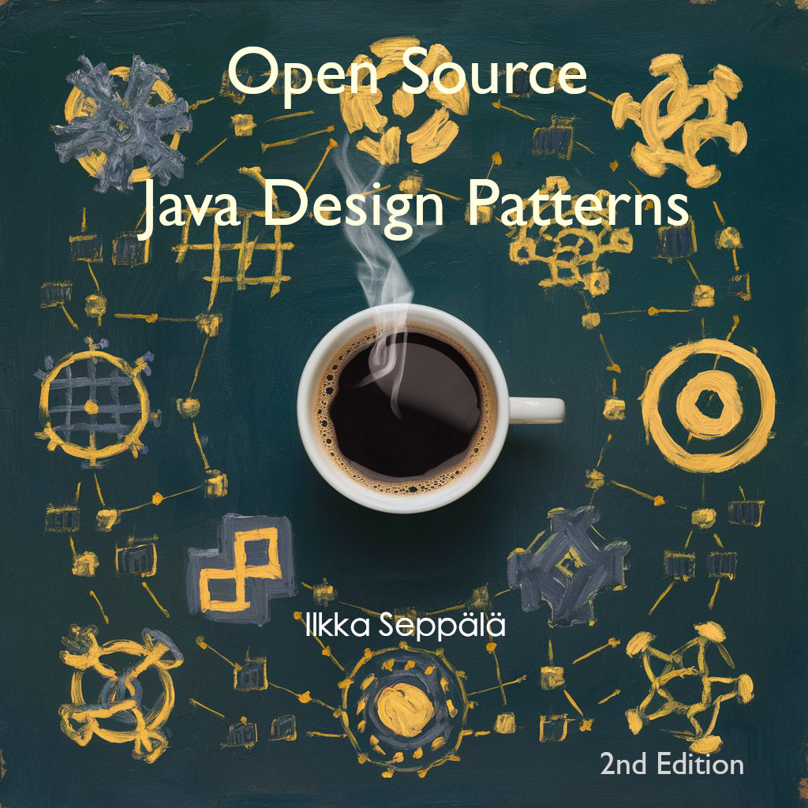

# Get the Book

## For the Price of a Cup of Coffee ☕️, Unlock the Power of Advanced Java Development with "Open Source Java Design Patterns"

**Are you a Java developer looking to elevate your coding skills and architectural knowledge?** Look no further than ["Open Source Java Design Patterns"](https://payhip.com/b/kcaF9), the essential guide for mastering the art of design patterns in Java. This comprehensive resource is your gateway to creating robust, maintainable, and scalable software systems.

## What's Inside?

1. **158 Design Patterns**:
    - Abstract Document
    - Abstract Factory
    - Active Object
    - And many more... [Get the free book sample from the store](https://payhip.com/b/kcaF9) to see the full table of contents.

2. **14 Categories**:
   - Architectural
   - Behavioral
   - Concurrency
   - And many more...

3. **79 Tags**:
   - Abstraction
   - Accumulation
   - Architecture
   - And many more...

4. **746 Pages**:
   - Comprehensive and detailed explanations.
   - Step-by-step tutorials.
   - Real-world examples.
   - Practical implementation tips.
   - Code snippets and diagrams.

## Why This Book?

- **Comprehensive Coverage**: From creational to structural to behavioral patterns, this book covers every essential design pattern you need to know.
- **Hands-On Examples**: Real-world examples and practical tutorials to help you apply each pattern in your projects.
- **Expert Insights**: Learn from experienced Java developers and architects who share their best practices and tips.
- **Scalability and Maintainability**: Discover patterns that make your code more scalable, maintainable, and adaptable to change.

## Transform Your Coding Practices

Whether you're a beginner or an experienced developer, ["Open Source Java Design Patterns"](https://payhip.com/b/kcaF9) provides the knowledge and tools to transform your coding practices. Understand the principles behind each pattern and learn how to implement them effectively in your projects.

## Get Your Copy Today!

Don't miss out on the opportunity to become a more skilled and efficient Java developer. Enhance your programming toolkit with ["Open Source Java Design Patterns"](https://payhip.com/b/kcaF9) and take your software development skills to the next level.

**[Order now](https://payhip.com/b/kcaF9) and start your journey towards mastering Java design patterns!**

---
By focusing on the key aspects and benefits of the book, this advertisement aims to attract both novice and seasoned Java developers interested in enhancing their skills and understanding of design patterns. If you have any specific details or highlights you want to include, feel free to let me know!
